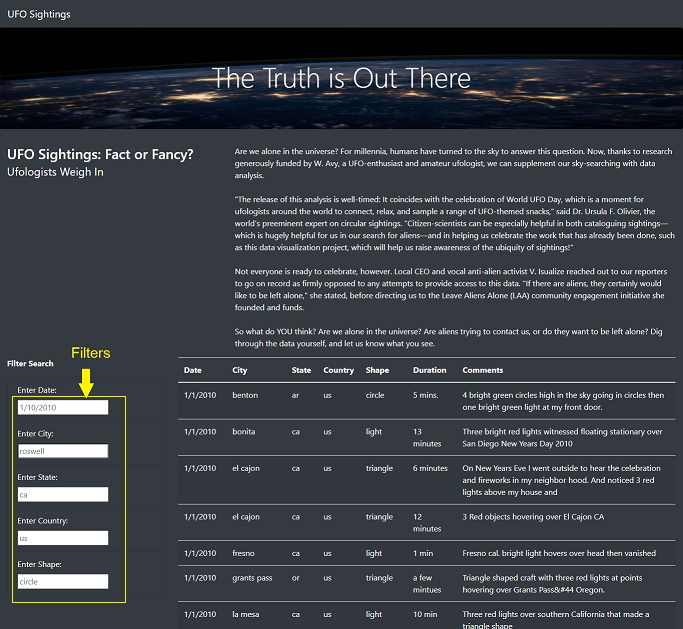
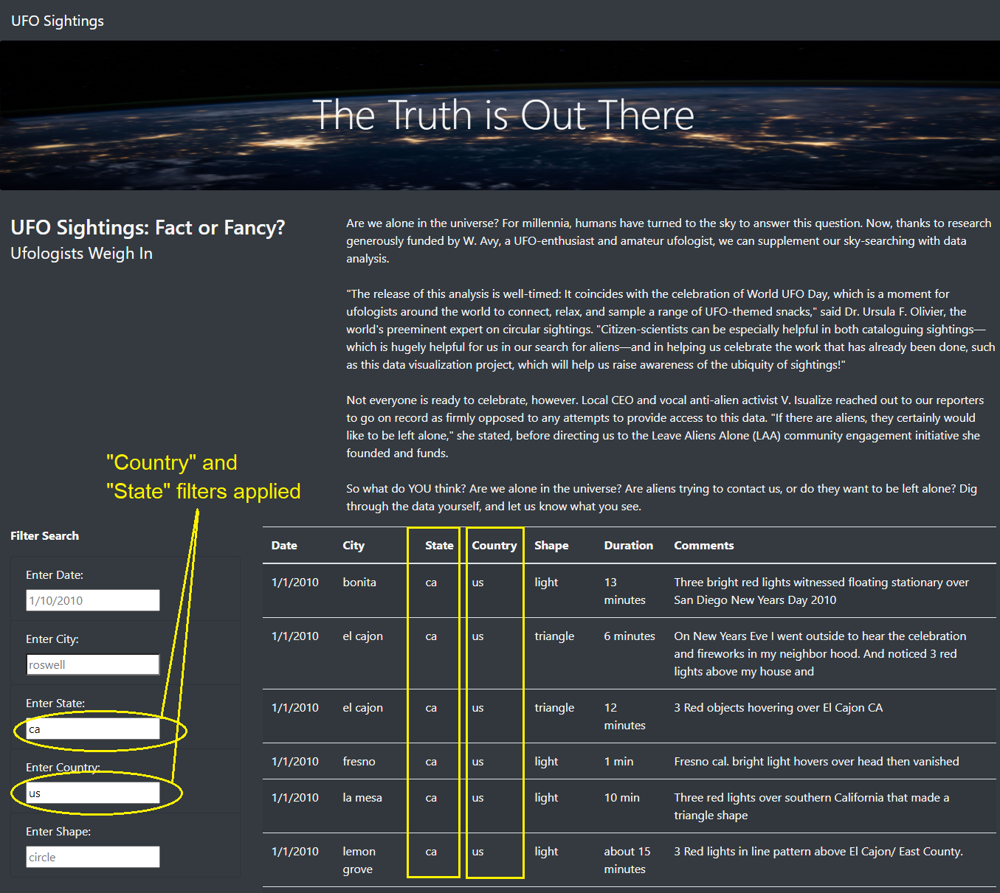
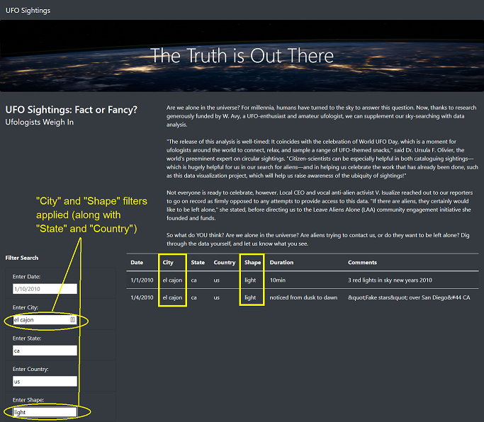
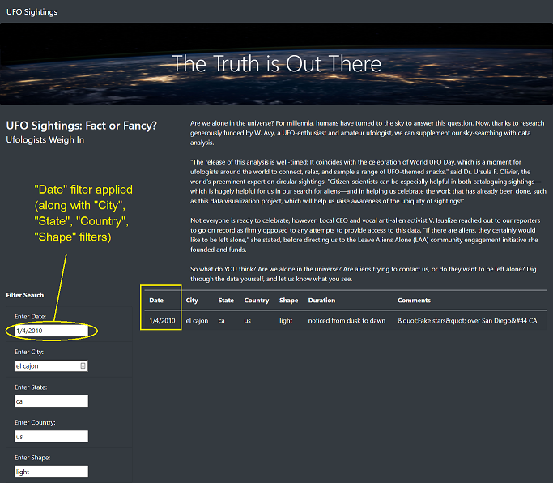

# UFOs

## Overview

Dana is a data journalist who gets an opportunity to write about UFO sigtings in her hometown McMinnville, Oregon. She is really interested in the topic and has a JavaScript file with sigtings information. 

### Purpose

Dana wants to present UFO sightings data in a table along with her article in a tidy HTML page. Since going through a large amount of data can be challenging for a reader, she has decided to create a number of easy-to-use filters using JavaScript to help sift through the data. She will also be using Bootstrap to visually enhance the webpage and make it responsive for device type.

* **Data Source:** data.js
* **Challenge Files:** app.js, index.html, style.css
* **Softwares/Languages:** JavaScript, HTML, CSS

**Link to Web App:** https://sanketkumaronline.github.io/UFOs/index.html

## Description

The UFO sigtings data is presented in a tablular format just below the news article. There are seven columns in the table:

1. Date
2. City
3. State
4. Country
5. Shape
6. Duration
7. Comments

There are about 111 rows in the table. Since can be difficult sifting through the data, the tabular data can be filtered based on some of these coulmns with the help of text input boxes placed on the left hand side of webpage. 

Suppose we want to see UFO sigtings only in US, then we can filter the data by entering country name (short form) in "Enter Country" text box. If we want to narrow it down further and want to see the data for a particluar state (for e.g. California), we can add the state name in the "Enter State" text box. In the screenshot below, we have selected **Country** as "us" and **state** as "ca". It returns only 30 row. 

We can further narrow down the sigtings based on some additional criteria. For e.g., if we want to see sigtings in a particlaur city in California, we can enter city name in "Enter City" text box. We can also filter the data based on the shape of UFOs. In the screenshot below, we have entered **City** as "el cajon" and **Shape** as "light". The filters from previous steps are still applied. So now we have data for sitings in El Cajon, Caifornia when only a light(s) was visible instead of a well defined shape. It returns only 2 row which match all these filters. 

Out of filtered data mentioned above, we can also apply date filter if we want to see sightings from a particluar date by entering the date in "Enter Date" text box. In screenahot below, we have applied **Date** filter as 1/4/2010. It returns only 1 row. 

