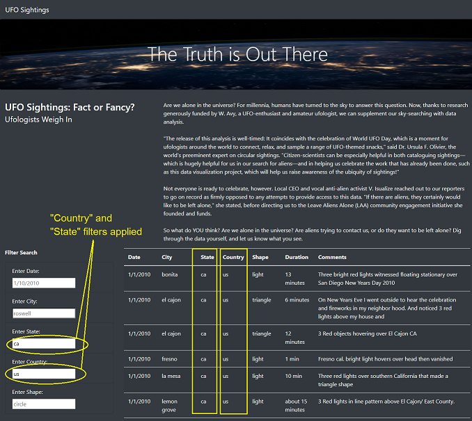

# UFOs

## Overview

Dana is a data journalist who gets an opportunity to write about UFO sightings in her hometown McMinnville, Oregon. She is really interested in the topic and has a JavaScript file with sightings information. 

### Purpose

Dana wants to present UFO sightings data in a table along with her article in a tidy HTML page. Since going through a large amount of data can be challenging for a reader, she has decided to create a number of easy-to-use filters using JavaScript to help sift through the data. She will also be using Bootstrap to visually enhance the webpage and make it responsive for device type.

* **Data Source:** data.js
* **Challenge Files:** app.js, index.html, style.css
* **Softwares/Languages:** JavaScript, HTML, CSS

**Link to Web App:** https://sanketkumaronline.github.io/UFOs/

## Description

The UFO sightings data is presented in a tabular format just below the news article. There are seven columns in the table:

1. Date 
2. City
3. State
4. Country
5. Shape
6. Duration
7. Comments

There are about 111 rows in the table. Since can be difficult sifting through the data, the tabular data can be filtered based on some of these columns with the help of text input boxes placed on the left hand side of webpage. 

Suppose we want to see UFO sightings only in US, then we can filter the data by entering country name (short form) in "Enter Country" text box. If we want to narrow it down further and want to see the data for a particular state (for e.g. California), we can add the state name in the "Enter State" text box. In the screenshot below, we have selected **Country** as "us" and **state** as "ca". It returns only 30 row. 

We can further narrow down the sightings based on some additional criteria. For e.g., if we want to see sightings in a particlaur city in California, we can enter city name in "Enter City" text box. We can also filter the data based on the shape of UFOs. In the screenshot below, we have entered **City** as "el cajon" and **Shape** as "light". The filters from previous steps are still applied. So now we have data for sightings in El Cajon, California when only a light(s) was visible instead of a well-defined shape. It returns only 2 row which match all these filters. 

Out of filtered data mentioned above, we can also apply date filter if we want to see sightings from a particular date by entering the date in "Enter Date" text box. In screenshot below, we have applied **Date** filter as 1/4/2010. It returns only 1 row. 

## Summary

### Drawback

1. Currently, the filter does not work for *partial text/value* entered. I.e. it will only work when the text entered matches the entire text in the corresponding cells. For e.g., if we want to find results for "park city", the City filter will not work if we just enter "park". This could be problematic if a person does not remember the exact name or spellings. Also, the filters are *case sensitive*. This can lead a person to believe that the record does not exist if they entered upper case alphabets. 

### Additional Recommendations

1. We can add a count of total number of results/rows returned. This will be helpful in showing us how many rows are returned after applying the filter without having to manually count all the rows. This will help us make a decision if we want to further narrow down our search if the number of rows are too large. We can add it in the lower right corner just after the last row.

2. We can add a "Clear Filters" button to delete the values entered in all the filters for convenience of customers. This can allow them to quickly modify their search without having to manually delete all the values entered. 

3. If we add the functionality to search using partial text, we can include additional filters to search **Duration** and **Comments** columns. This will help us search these filed more effectively. For e.g., if we want to find a sighting a duration of 30 minutes, we can just enter "30" (for 30 minutes ) or "half" (half an hour) without having to worry about the accompanying text or misspelling of "minutes" in some of the data values. Also, we can search the Comments column for certain information such as color of the sightings.

